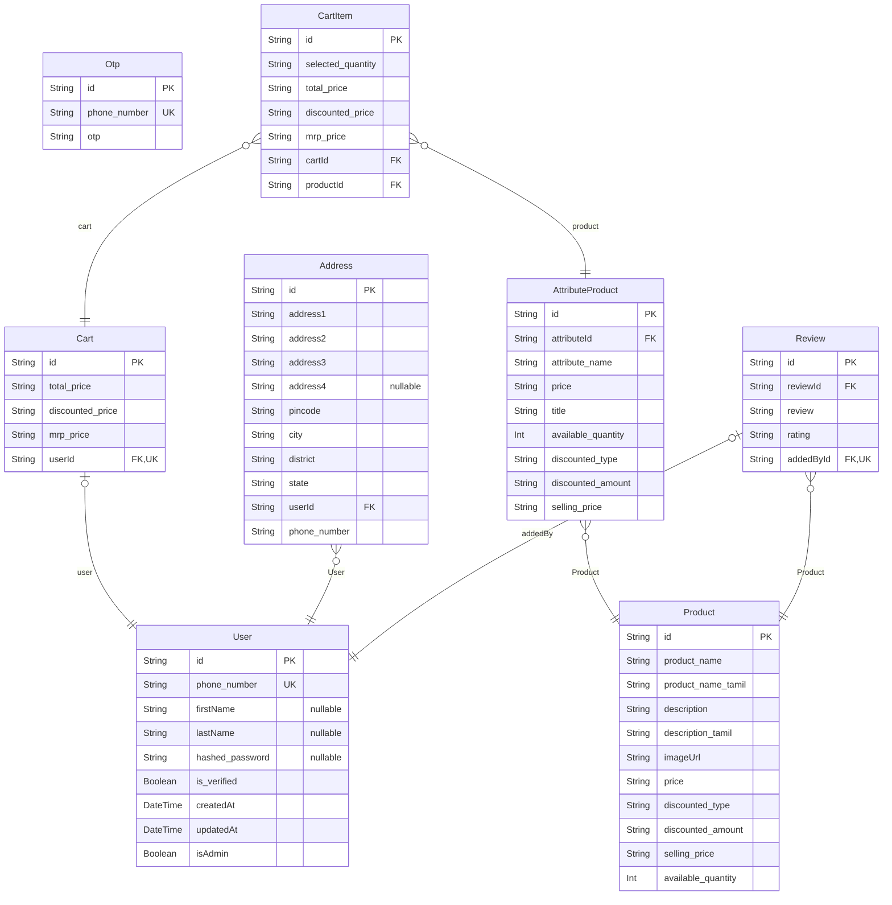

# FutureNature Backend Schema

> Generated by [`prisma-markdown`](https://github.com/samchon/prisma-markdown)

- [default](#default)

## default

### `User`

Properties as follows:

- `id`:
- `phone_number`:
- `firstName`:
- `lastName`:
- `hashed_password`:
- `is_verified`:
- `createdAt`:
- `updatedAt`:
- `isAdmin`:

### `Otp`

Properties as follows:

- `id`:
- `phone_number`:
- `otp`:

### `Product`

Properties as follows:

- `id`:
- `product_name`:
- `product_name_tamil`:
- `description`:
- `description_tamil`:
- `imageUrl`:
- `price`:
- `discounted_type`:
- `discounted_amount`:
- `selling_price`:
- `available_quantity`:

### `Review`

Properties as follows:

- `id`:
- `reviewId`:
- `review`:
- `rating`:
- `addedById`:

### `AttributeProduct`

Properties as follows:

- `id`:
- `attributeId`:
- `attribute_name`:
- `price`:
- `title`:
- `available_quantity`:
- `discounted_type`:
- `discounted_amount`:
- `selling_price`:

### `Address`

Properties as follows:

- `id`:
- `address1`:
- `address2`:
- `address3`:
- `address4`:
- `pincode`:
- `city`:
- `district`:
- `state`:
- `userId`:
- `phone_number`:

### `Cart`

Properties as follows:

- `id`:
- `total_price`:
- `discounted_price`:
- `mrp_price`:
- `userId`:

### `CartItem`

Properties as follows:

- `id`:
- `selected_quantity`:
- `total_price`:
- `discounted_price`:
- `mrp_price`:
- `cartId`:
- `productId`:
